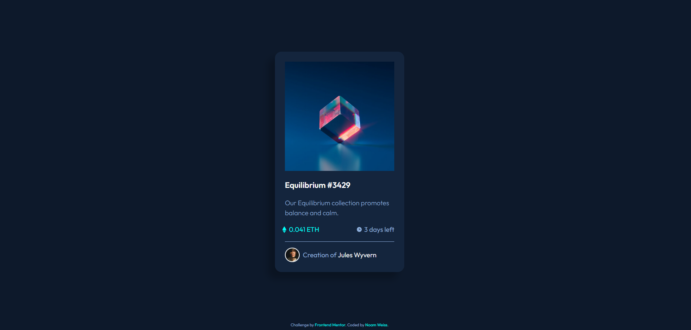

# Card Component for Previewing an NFT for Sale



This project is a solution to a challenge from [Frontend Mentor](https://www.frontendmentor.io/). It consists of an HTML file and a SASS file that define a card component for previewing an NFT for sale. The component includes the NFT's image, title, description, price, time remaining, and creator credit, as well as design and interaction elements to enhance the user experience.
Table of Contents

## HTML Structure

The HTML file for the card component includes several semantically-meaningful elements, such as `main`, `section`, and `footer`, to clearly organize the content within the component.

## SASS Styles

One of the most impressive parts of the SASS styles is the use of pseudo-elements to create a hover effect on the `img` element:

```scss
.img {
    &::after {
        content: url(./images/icon-view.svg);
        display: grid;
        place-content: center;
        position: absolute;
        top: 0;
        height: 100%;
        width: 100%;
        background-color: hsla(178, 100%, 50%, 0.5);
        opacity: 0;
        transform: scaleY(0);
        transform-origin: bottom;
        transition: all 200ms ease;
    }

    &:hover::after {
        opacity: 1; 
        transform:  scaleY(1);
    }
}
```

This code uses the `::after` pseudo-element to insert an icon over the image when the mouse hovers over it. It also applies a transition effect to smoothly change the icon's opacity and scale.

Another notable feature of the SASS styles is the use of a `max-width` property on the card element to ensure that the component looks optimal at different screen sizes:

```scss
.card {
    max-width: 350px;
}
```

This code sets a max-width of 350px on the card element, which ensures that the component will not stretch beyond a certain width on smaller screens, while still allowing it to grow larger on larger screens as needed.

## Conclusion

The combination of well-crafted HTML and SASS styles has resulted in a highly effective card component for previewing an NFT for sale. It effectively showcases the unique qualities of each NFT and makes it easy for potential buyers to learn more about them, while also offering a visually appealing and user-friendly experience. The use of SASS features such as pseudo-elements, as well as the use of a max-width property on the card element, has helped to create a highly efficient and maintainable component.

## Further Development
There are several ways that the card component could be further developed or improved:

* Adding media queries to create a responsive layout that adapts to different screen sizes
* Adding more interactive elements, such as buttons or forms, to allow users to purchase or make offers on the NFT
* Adding more SASS features, such as mixins or functions, to further optimize and simplify the styles
* Refining the design and layout to create a more cohesive and visually appealing overall aesthetic

There are many possibilities for continuing to improve and evolve the card component, and there is always room for growth and learning as a developer. As I continue to work on this project and take on new challenges, I hope to expand my skills and knowledge in the areas of HTML, CSS, and SASS.

## links 
* live site: https://noamweisss.github.io/NFTcard-FrontedMentor/
